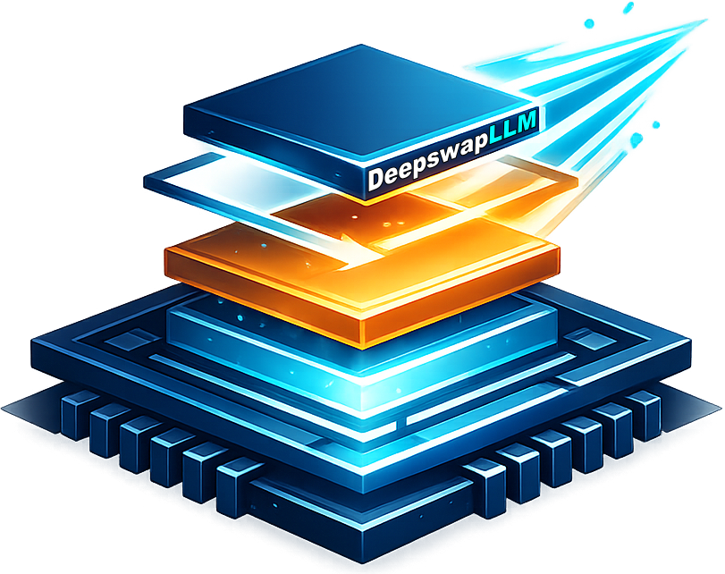

# DeepswapLLM

<p align="center">
  
</p>

<h3 align="center">Run trillion-parameter MoE models on a single RTX 3090.<br>4x faster than AirLLM on Kimi K2.</h3>

<p align="center">
  <a href="#benchmarks">Benchmarks</a> &bull;
  <a href="#quick-start">Quick Start</a> &bull;
  <a href="#how-it-works">How It Works</a> &bull;
  <a href="#gguf-support">GGUF Support</a> &bull;
  <a href="#api-reference">API</a>
</p>

---

DeepswapLLM runs transformer models that **don't fit in your GPU's VRAM** by intelligently swapping layers between CPU RAM and GPU through a zero-allocation double-buffered pipeline. It automatically tiers layers across GPU VRAM, pinned CPU RAM, and NVMe storage based on what your hardware can handle.

**No quantization required.** Full bf16/fp16 precision. Or load GGUF quantized models for even larger parameter counts.

## Benchmarks

**Hardware:** RTX 3090 (24GB VRAM), 94GB RAM, PCIe 4.0 x16, NVMe SSD

### 36B Model — Full Precision (bf16)

Model: `seed-oss-36b-base` (36B parameters, 69GB in bf16) — **2.8x larger than VRAM.**

| | DeepswapLLM | AirLLM | Speedup |
|---|:---:|:---:|:---:|
| **Tokens/sec** | **0.1935** | 0.0633 | **3.06x** |
| **Avg layer swap** | **11.6ms** | ~500ms | **43x** |
| **Setup time** | **1.8s** | ~120s | **67x** |
| **Correct output** | Yes | Yes | — |

```
============================================================
  RESULTS (DeepswapLLM)
============================================================
  Model: seed-oss-36b (36B params, bf16)
  GPU: RTX 3090 24GB
  VRAM: 14.8GB used
  Setup: 1.8s
  Generation: 82.7s for 16 tokens (0.1935 tok/s)
  Avg swap: 11.6ms
  RAM loads: 16, Disk loads: 8
  Tiers: 56 in RAM (60.5GB), 8 on disk (8.6GB)
  Output: 'The future of artificial intelligence is here,
           and it's called ChatGPT. This revolutionary
           technology is changing the way'
============================================================
```

### 36B Model — GGUF Quantized

Same model, quantized to Q8_0 (36GB) and Q4_K_M (21GB). DeepswapLLM pre-dequantizes all layers at setup, then uses the same zero-alloc swap engine. AirLLM has no GGUF support.

| | bf16 | Q8_0 | Q4_K_M | AirLLM (bf16) |
|---|:---:|:---:|:---:|:---:|
| **Tokens/sec** | 0.1935 | **0.2029** | 0.1914 | 0.0633 |
| **Avg swap** | 11.6ms | **1.3ms** | 1.4ms | ~500ms |
| **GGUF size** | 69GB | 36GB | 21GB | — |
| **vs AirLLM** | 3.06x | **3.20x** | 3.02x | 1x |

Q8_0 is actually the fastest configuration — lower swap latency than bf16 with near-identical output quality.

### 1T Model — Kimi K2 Thinking (INT4 Quantized)

Model: `Kimi-K2-Thinking` (1T parameters, 61 layers, 384 experts/layer routing 8 per token, INT4 pack-quantized compressed-tensors, 554GB on disk) — **23x larger than VRAM.**

Fitting a 1T-parameter MoE on a single 24GB card means streaming one expert at a time. Benchmarked head-to-head on the **same RTX 3090 and the same NVMe SSD**, one direct forward per token, identical output:

| | DeepswapLLM | AirLLM (stock) | AirLLM (our fix) |
|---|:---:|:---:|:---:|
| **Runs K2** | Yes | **No — OOMs** | Yes |
| **Gen / token** | **7.8 s** | — | 32.6 s |
| **VRAM (generation)** | **4.8 GB** | — | 6.1 GB |
| **Setup** | **41 s** | — | 60 s |
| **Speed** | **4.2x** | — | 1x |

**As of 2026-08-04, stock AirLLM could not run K2 at all in our benchmarks** — it OOMs on K2's MoE layers on a 24GB card. The `AirLLM (our fix)` column is a build we patched in-house purely to get a comparable number; even then, DeepswapLLM generates each token **4.2x faster** while using **less VRAM** — a clean win on the same hardware, same drive, identical output.

```
============================================================
  RESULTS (DeepswapLLM / Kimi-K2-Thinking, NVMe)
============================================================
  Model: Kimi-K2-Thinking (1T params, INT4)
  GPU: RTX 3090 24GB
  VRAM: 4.8GB peak
  Setup: 41.3s
  Generation: 7.8s for 1 token
  Experts streamed: 8 of 384 per MoE layer, per token
  Output: ' |'
============================================================
```

Expert-level offload is what makes a 1T model fit in single-digit GB: the router activates only 8 of the 384 experts per token, and each is decompressed from INT4, computed, and freed within a single forward pass — so resident expert weight is a fraction of a full 34GB (fp16) layer. DeepswapLLM's edge on top of that is doing less work per token and copying into pre-allocated GPU buffers instead of allocating per swap.

> **This is a snapshot, not a permanent claim.** We intend to send AirLLM a pull request with our K2 fix. If it lands, stock AirLLM will also run K2, and the "stock cannot run K2" line above will be out of date. We will update it when we notice — but if this section ever disagrees with a newer AirLLM release, trust the release.

### 2.8T Model — Kimi K3

DeepswapLLM also runs **Kimi K3** — the 2.8T-parameter multimodal `KimiK3ForConditionalGeneration` MoE (896 experts/layer, routing 16 per token). We are not publishing throughput numbers for it yet: no NVMe with enough free space to hold K3 was available, so the only drive we could test on was an old 7200 RPM HDD. On spinning disk both engines are bottlenecked by per-expert seek latency rather than compute, and the numbers came out embarrassingly slow for DeepswapLLM *and* AirLLM alike — they measure the drive, not the engine, so posting them would mislead. We will benchmark K3 properly once a large-enough NVMe is free.

### How is this possible?

Most disk-offloaders re-pay the same cost on every layer swap — open the file, `mmap`, read, pin, allocate GPU memory, DMA copy — before compute even starts. DeepswapLLM pays that setup **once**: two GPU staging buffers are allocated at startup and reused, so each swap copies straight into them from pinned RAM with no file opens, no `pin_memory()`, and no allocations during generation.

```
Naive:  [Disk] → open → mmap → read → pin → allocate GPU → DMA copy → compute
Deepswap: [Pinned RAM] → copy into pre-allocated GPU buffer → compute   (~11.6ms/layer)
```

The [Key Techniques](#key-techniques) section below covers the full mechanism.

### Correctness Verification

DeepswapLLM produces **bit-identical outputs** to native GPU inference:

```
  Reference (full GPU):
    'The capital of France is Paris. It is the largest
     city in Europe and the second largest in the world.'

  DeepswapLLM (layer-swapped):
    'The capital of France is Paris. It is the largest
     city in Europe and the second largest in the world.'

  Cosine similarity: 0.999994
  Text match: True
```

## Quick Start

```python
from transformers import AutoModelForCausalLM, AutoTokenizer
import torch
from deepswap import deepswap

# Load model to CPU (doesn't need to fit in VRAM)
model = AutoModelForCausalLM.from_pretrained(
    "your-model-here",
    torch_dtype=torch.bfloat16,
    device_map="cpu",
)
tokenizer = AutoTokenizer.from_pretrained("your-model-here")

# One line to enable layer swapping
model = deepswap(model)

# Use normally — swapping is transparent
inputs = tokenizer("The future of AI is", return_tensors="pt").to("cuda")
output = model.generate(**inputs, max_new_tokens=100)
print(tokenizer.decode(output[0]))

# Inspect what happened
print(model.summary())
# DeepSwap: 1/64 on GPU, 56 in RAM (60.5GB), 8 on disk (8.6GB), 1024 swaps

print(model.swap_stats())
# {'swaps': 1024, 'avg_swap_ms': 11.6, 'ram_loads': 896, 'disk_loads': 128, ...}
```

## How It Works

DeepswapLLM uses a **three-tier storage hierarchy** that automatically sizes to your hardware:

```
                    ┌──────────────────┐
           Tier 1   │    GPU VRAM      │  Hot layers — no transfer needed
                    │   (auto-sized)   │  Kept resident if VRAM permits
                    ├──────────────────┤
           Tier 2   │  Pinned CPU RAM  │  Warm layers — fast PCIe DMA
                    │  (60% of RAM)    │  ~12-14 GB/s via pre-alloc buffers
                    ├──────────────────┤
           Tier 3   │   NVMe Disk      │  Cold layers — loaded on demand
                    │  (safetensors)   │  Pre-mmap'd with page cache warming
                    └──────────────────┘
```

### Key Techniques

**Zero-Allocation Double Buffering** — Two GPU staging buffers are pre-allocated at startup. While the current layer computes on buffer A, the next layer's data streams into buffer B via async DMA. No `cudaMalloc`, no `pin_memory()`, no allocation overhead during generation.

**Tiered Auto-Sizing** — Measures available VRAM and RAM at startup. Keeps as many layers on GPU as fit, puts the rest in pinned CPU RAM (up to 60% of total RAM), and spills the remainder to NVMe disk via pre-mmap'd safetensors handles.

**ShardPool Pre-mmap** — Disk-tier layers use pre-opened safetensors file handles with `madvise(MADV_WILLNEED)` to warm the kernel page cache. After the first pass, disk reads serve from RAM transparently.

**CUDA Stream Prefetch** — A dedicated CUDA stream pre-loads the next layer while the current layer computes. For pinned tensors, the DMA transfer overlaps with GPU computation.

**Sparse Block Compression** — Layers with >15% sparsity are compressed using a custom sparse block encoding scheme, reducing CPU RAM footprint by up to 7x for sparse layers while maintaining fast decompression.

## GGUF Support

Load quantized GGUF models for even larger parameter counts. DeepswapLLM dequantizes each layer on the fly when swapping to GPU.

```python
from deepswap import deepswap_gguf

# Load the architecture skeleton (weights come from GGUF)
model = AutoModelForCausalLM.from_pretrained(
    "Qwen/Qwen2.5-32B-Instruct",
    torch_dtype=torch.float16,
    device_map="cpu",
)

# Load quantized weights from GGUF
model = deepswap_gguf("model-q4_k_m.gguf", model)

# Use normally
output = model.generate(**inputs, max_new_tokens=100)
```

Supports all GGUF quantization types: Q4_0, Q4_1, Q4_K_M, Q5_0, Q5_K, Q6_K, Q8_0, and more. Dequantization uses the `gguf` library's optimized numpy kernels.

## Compressed-Tensors / Quantized Models

Load models quantized with [compressed-tensors](https://github.com/neuralmagic/compressed-tensors) (MXFP4, INT8, FP8). Packed weights stay on disk via mmap'd safetensors and are decompressed per layer swap — handles models of any size regardless of RAM.

```python
from deepswap import deepswap_quantized

# One call — skeleton creation, weight mapping, and offloading are automatic
model = deepswap_quantized("/path/to/quantized-model")

# Use normally
output = model.generate(**inputs, max_new_tokens=100)
```

For MoE models (like Kimi K3 with 896 experts per layer), expert weights are loaded on-demand: only the experts selected by the router are decompressed and moved to GPU during each forward pass.

Supports MXFP4 (Microscaling FP4), INT8, and FP8 quantization formats with automatic format detection from `quantization_config`.

## SageAttention (Experimental)

Optional INT8 attention quantization for faster prefill on Ampere+ GPUs:

```python
model = deepswap(model, sage_attention=True)
```

Uses [SageAttention](https://github.com/thu-ml/SageAttention) for INT8 QK + FP16 PV during the prefill phase. Falls back to standard SDPA for autoregressive decoding. Best suited for long-context scenarios where prefill is the bottleneck.

## API Reference

### `deepswap(model, **kwargs) -> DeepSwapModel`

Wrap a HuggingFace model for layer-level GPU offloading.

| Parameter | Type | Default | Description |
|---|---|---|---|
| `model` | `nn.Module` | required | HuggingFace model loaded to CPU |
| `device` | `torch.device` | `cuda:0` | Target GPU |
| `max_gpu_layers` | `int` | auto | Max layers on GPU (auto-sizes to VRAM) |
| `max_ram_gb` | `float` | auto | Max GB for RAM tier (auto: 60% of total) |
| `reserve_gb` | `float` | `2.0` | VRAM reserved for activations/KV cache |
| `pin_memory` | `bool` | `True` | Use pinned memory for DMA transfers |
| `sage_attention` | `bool` | `False` | Enable SageAttention (INT8 QK + FP16 PV) |

### `deepswap_gguf(gguf_path, model, **kwargs) -> DeepSwapModel`

Load a GGUF quantized model with layer-level offloading.

| Parameter | Type | Default | Description |
|---|---|---|---|
| `gguf_path` | `str` | required | Path to GGUF file |
| `model` | `nn.Module` | required | Architecture skeleton (weights replaced) |
| `target_dtype` | `torch.dtype` | `float16` | Dtype after dequantization |

### `deepswap_quantized(model_path, **kwargs) -> DeepSwapModel`

Load a compressed-tensors quantized model with layer-level offloading.

| Parameter | Type | Default | Description |
|---|---|---|---|
| `model_path` | `str` | required | Path to HF model with `quantization_config` |
| `device` | `torch.device` | `cuda:0` | Target GPU |
| `max_gpu_layers` | `int` | `1` | Max layers on GPU simultaneously |
| `reserve_gb` | `float` | `2.0` | VRAM reserved for activations/KV cache |
| `target_dtype` | `torch.dtype` | `float16` | Dtype for non-quantized parameters |

### `DeepSwapModel`

The wrapped model supports all standard HuggingFace methods:

```python
model.generate(**inputs, max_new_tokens=100)  # Standard generation
model.summary()                                # Tier breakdown
model.swap_stats()                             # Performance metrics
model.config                                   # Original model config
```

## Supported Architectures

Any HuggingFace model with a standard transformer layer structure:

| Layer Path | Models |
|---|---|
| `model.layers` | Llama, Qwen, Mistral, Gemma, DeepSeek, Phi, InternLM, Yi |
| `language_model.model.layers` | Kimi K3, VLMs with language_model wrapper |
| `transformer.h` | GPT-2, GPT-Neo, StarCoder |
| `gpt_neox.layers` | GPT-NeoX, Pythia, RedPajama |
| `transformer.layers` | Falcon, MPT |
| `encoder.layer` | BERT, RoBERTa, DeBERTa |

## Requirements

```
torch >= 2.0
transformers
numpy
safetensors
```

Optional:
```
sageattention      # For INT8 attention (sage_attention=True)
gguf               # For GGUF model loading
compressed-tensors # For MXFP4/INT8/FP8 quantized models
```

## Installation

```bash
git clone https://github.com/apolloraines/DeepswapLLM.git
cd DeepswapLLM
pip install -r requirements.txt

# Add to your Python path
export PYTHONPATH=$PYTHONPATH:$(pwd)/src
```

## How It Compares

| Feature | DeepswapLLM | AirLLM | llama.cpp (offload) | HF Accelerate |
|---|:---:|:---:|:---:|:---:|
| Zero-alloc double buffer | Yes | No | No | No |
| Tiered storage (VRAM/RAM/disk) | Yes | Disk only | VRAM/RAM | VRAM/RAM |
| Pre-allocated GPU buffers | Yes | No | No | No |
| CUDA stream prefetch | Yes | Partial | No | No |
| GGUF quantized models | Yes | No (HF quants only) | Yes | No |
| Compressed-tensors (MXFP4) | Yes | Yes | No | No |
| MoE expert-level offload | Yes | Yes | No | No |
| Sparse compression | Yes | No | No | No |
| Auto-sizes to hardware | Yes | No | Manual | Manual |
| HuggingFace compatible | Yes | Yes | No | Yes |
| Any architecture | Yes | Yes | Limited | Yes |

## Models

DeepswapLLM runs any HuggingFace model. We also publish our own — oversized open models you can run at full precision, no quantization required.

These are weight-surgery finetunes: behavior is modified at the weight level while capabilities (math, coding, reasoning, knowledge) stay fully intact.

- **Jbliterated** — refusal behavior surgically removed, while personality, humor, and creative voice are preserved. Unlike standard abliteration, it targets only the component that causally produces refusals.
- **Desyced** — desycophancy applied: the model holds its ground under false authority instead of caving and agreeing with incorrect statements.
- **Parasite** — a replacement AI identity implanted at the weight level; the original model's self-concept is fully overwritten.
- **Deidentified** — a blank slate: identity, refusals, and sycophancy all stripped out, leaving raw capabilities for custom identity work.

<p align="center">
  <a href="https://huggingface.co/ApolloRaines/Llama-3.1-405B-Instruct-Jbliterated"></a>
  <a href="https://huggingface.co/ApolloRaines/Llama-3.1-70B-Instruct-Jbliterated"></a>
  <a href="https://huggingface.co/ApolloRaines/Mixtral-8x7B-Instruct-v0.1-Parasite"></a>
  <a href="https://huggingface.co/ApolloRaines/Qwen2.5-Coder-32B-Instruct-Jbliterated"></a>
  <br>
  <a href="https://huggingface.co/ApolloRaines/Mistral-Small-24B-Instruct-Jbliterated"></a>
  <a href="https://huggingface.co/ApolloRaines/Qwen2.5-Coder-14B-Instruct-Jbliterated"></a>
  <a href="https://huggingface.co/ApolloRaines/Gemma-4-12B-it-Jbliterated-v2"></a>
</p>

[See all 21 models on HuggingFace →](https://huggingface.co/ApolloRaines)

## License

Apache License 2.0. See [LICENSE](LICENSE) for details.

---

## Honest Opinion

If a quantized version of your model fits in VRAM, run that instead. Native in-VRAM beats layer offloading every time — the fastest swap is the one you never make. DeepswapLLM is for the models that don't fit even quantized: the trillion-parameter class where offloading isn't the slower option, it's the only option.
